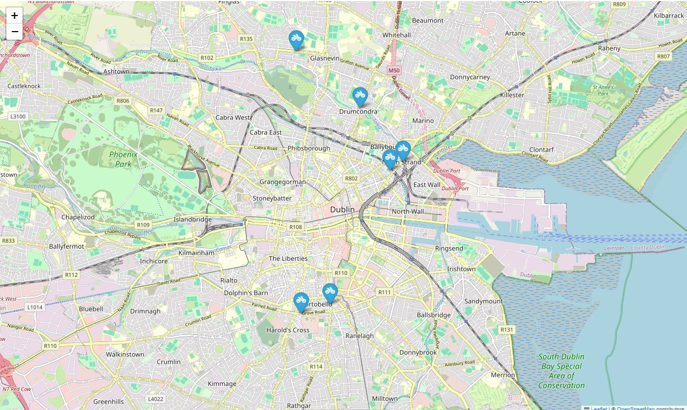

# Cycling Traffic - Dublin Council Counters

This project is the result of an academic assignment where I applied **Exploratory Data Analysis (EDA)** to understand cycling traffic patterns in Dublin. The dataset comes from sensors managed by Dublin City Council, which record the number of cyclists passing by every hour.

This work was part of the **Data Exploration & Preparation** module (Semester 7) of my degree at **CCT College Dublin**.

---

## Objectives

The main idea was to analyse the data in a way that could help city planning and mobility. I focused on:

- Understanding how cycling traffic varies by location.
- Identifying patterns over the year and throughout the day.
- Using clustering and PCA to find structure in the data and support decisions.

---

## Key Results

### 1. Cyclist Volume by Location  

Some places had a lot more traffic than others.  
- Grove Road Totem had the highest numbers (close to 1 million cyclists).  
- Richmond Street had the lowest (about 2,200 cyclists).  

---

### 2. Key Areas Grouped by Traffic  

I used clustering to group the counters based on traffic levels:  
- Grove Road was clearly high traffic.  
- Richmond Street was moderate.  
- Clontarf had more variable patterns depending on the time.

---

### 3. Seasonal Patterns  

There’s a big difference across the months:  
- May and June were the busiest months (over 500k cyclists).  
- In December, the number dropped to around 300k — likely due to cold weather.

---

### 4. Peak Hours  

I looked at what time of day most cyclists were recorded:  
- Morning peak: around 8:00 AM (1,560 cyclists)  
- Evening peak: around 5:00 PM (1,510 cyclists)  
So, commuting times make a big difference in traffic flow.

---

## Conclusions

Based on the analysis, I came up with a few points that might help with planning:

- **Focus on busy areas** like Grove Road and Clontarf when investing in new infrastructure.
- **Cold weather has a clear impact** — public transport may need to be adjusted during those periods.
- **Morning and evening peaks** show when people are commuting — good times to optimise traffic signals and flow.
- **Roadworks should be planned carefully**, so we don’t lose valuable cycling data.
- **Clustering techniques** helped to show where and when usage patterns are similar.

---

## Technologies

The whole project was done in Python using:

- Jupyter Notebook  
- Pandas, NumPy, Seaborn, Matplotlib  
- Scikit-learn (for clustering and PCA)

---

## References

- [Dublin City Council – Cycle Count Data](https://data.gov.ie/dataset/dublin-city-centre-cycle-counts)  
- [IBM: What is EDA?](https://www.ibm.com/topics/exploratory-data-analysis)  
- [Guide to EDA – Towards Data Science](https://towardsdatascience.com/a-data-scientists-essential-guide-to-exploratory-data-analysis-25637eee0cf6)  
- [SciPy Interpolation Docs](https://docs.scipy.org/doc/scipy/tutorial/interpolate.html)  
- [Atlassian: Scatter Plots](https://www.atlassian.com/data/charts/what-is-a-scatter-plot)  
- [Leaflet Maps](https://leafletjs.com/)  
- [OpenStreetMap](https://www.openstreetmap.org/)  
- [Zelt Eco-Multi Counter](https://traffictechnology.co.uk/blog/portfolio/eco-display-light/)  
- [Marsja: Transform Skewed Data](https://www.marsja.se/transform-skewed-data-using-square-root-log-box-cox-methods-in-python/)  
- Iqbal, M. (2024). *Data Exploration & Preparation*, CCT College Dublin — [Module page](https://moodle.cct.ie/course/view.php?id=1705)